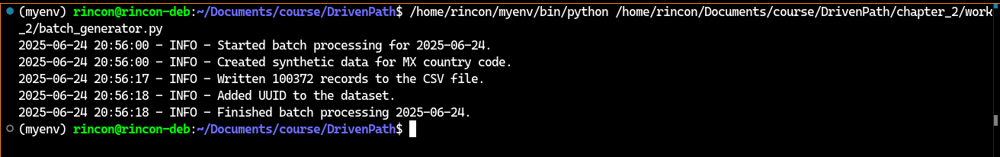
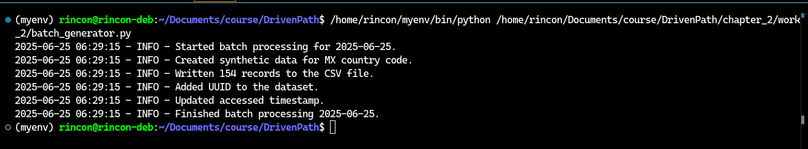
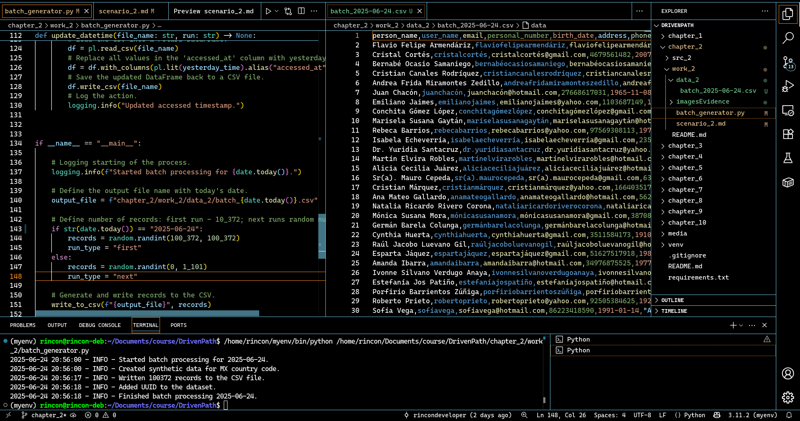
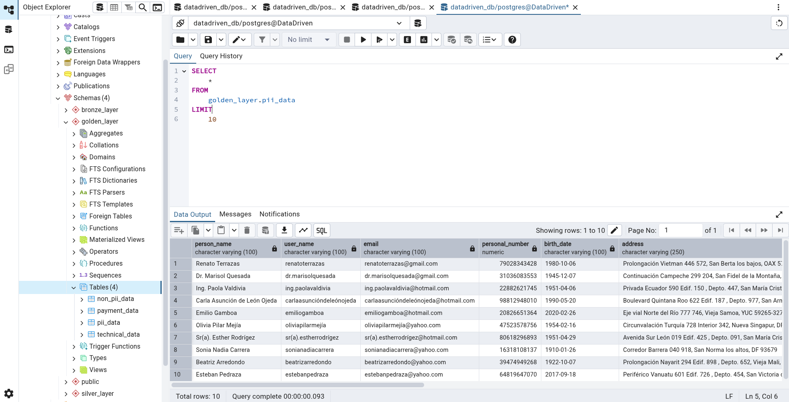

# Chapter 2: Batch Processing – Local Development

## 🛠️ My Objective
Analyze the DrivenData source by examining the data volume from the previous year, identifying the available fields and their data types. A local ETL pipeline was designed to extract raw data into the bronze layer, apply necessary transformations in the silver layer, and load the refined data into the golden layer. The golden layer includes four specific tables: a financial table for payment calculations, a technical table for issue analysis, a non-PII table for users with limited access, and a PII table for users with higher access privileges.

---

## ✅ Steps I Performed During This Activity

### 1. **Theory**
- I studied the following topics from the provided sources:

**a)** Extract, Transform, Load (ETL)  
**b)** Batch Processing  
**c)** Data Extraction  
**d)** Data Normalization  
**e)** Python  
**f)** SQL  
**g)** Framework Design

### 2. **Data Sources**
- I analyzed the two `.csv` files in the `src_2/data_2/` directory  
- I identified the data volume, available columns, and data types

### 3. **Data Generation**
- I created the `batch_generator.py` script using the `Faker` and `Polars` libraries  
- I analyzed and understood each function in the script  
- I generated 100,372 records and stored them in `work_2/data_2/batch_2025-06-24.csv`

### 4. **Data Transformation**
- I created the server and the database  
- Within the database, I created the table and its columns  
- I imported the generated records from `work_2/data_2/batch_2025-06-24.csv`  
- I ran a query to select and validate the raw data

### 5. **Bronze Layer**
- I created the `bronze_layer` schema  
- I repeated the process from the public schema and loaded the raw data

### 6. **Silver Layer**
- I created the `silver_layer` schema  
- I ran queries to check for missing and duplicate values (none found)  
- I reviewed the Star Schema design from the `docs_2` folder  
- I created the following tables: `dim_address`, `dim_date`, `dim_finance`, `dim_person`, and `fact_network_usage`

### 7. **Golden Layer**
- I created the `golden_layer` schema  
- I created the following tables: `payment_data`, `technical_data`, `non_pii_data`, and `pii_data`  
- I executed queries to test that the tables were populated and working correctly

---

## 🧾 Evidence
- `work_2/data_2/batch_2025-06-24.csv` and `work_2/data_2/batch_2025-06-25.csv`  
- `work_2/batch_generator.py`  
- **Screenshots**:

